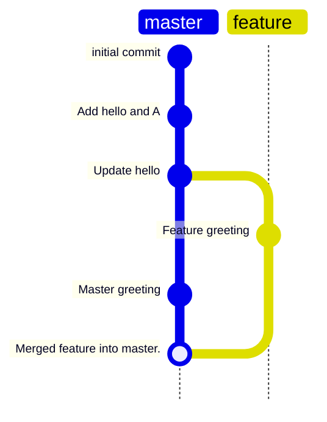
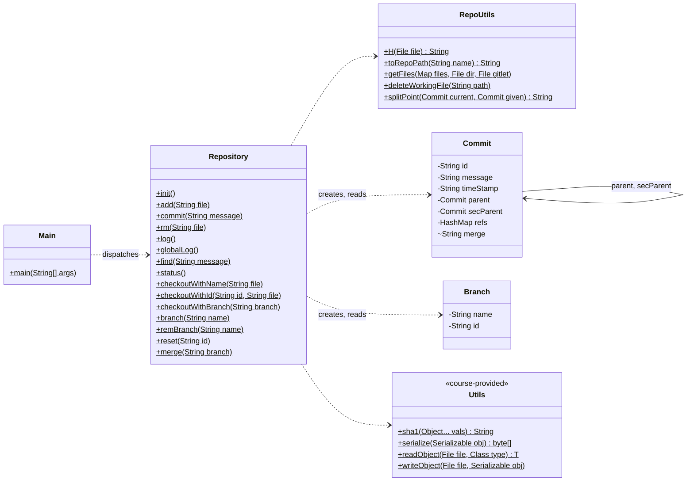
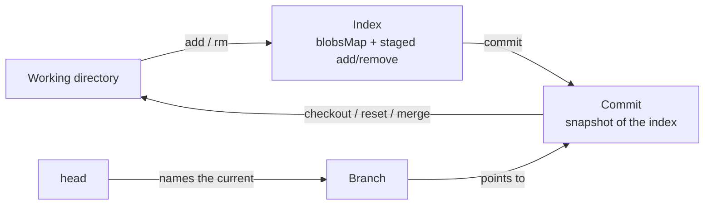
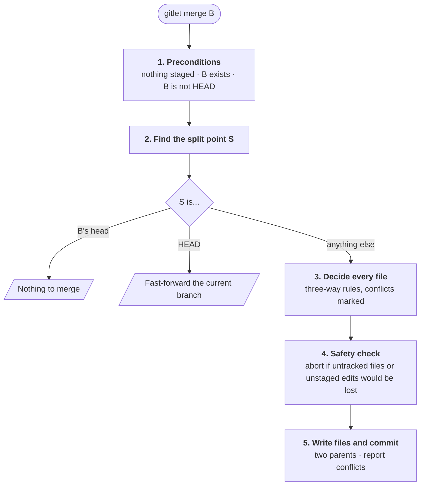

<div align="center">


# Gitlet

**A version-control system built from scratch in Java. It reimplements Git's core end to end.**

Content-addressed storage · SHA-1 commits · staging area · branches · three-way merge

[](https://github.com/tefaa1/Gitlet/actions/workflows/ci.yml)


[Quick start](#quick-start) · [Walkthrough](#walkthrough) · [Commands](#command-reference) · [How it works](#under-the-hood) · [Testing](#testing)

</div>

<br>

<p align="center">
  
</p>

<div align="center">

| **13** | **0** | **80+** | **3** |
| :---: | :---: | :---: | :---: |
| Git-style commands | runtime dependencies | end-to-end checks | operating systems in CI |

</div>

## Highlights

<table>
<tr>
<td width="50%" valign="top">

### Content-addressed storage
Every file version is a blob named by the SHA-1 of its bytes, so identical content is stored once. A commit's ID is the SHA-1 of its message, timestamp, snapshot and full ancestry, so changing anything in history changes every ID after it.

</td>
<td width="50%" valign="top">

### A real three-way merge
The split point is found by a breadth-first search that follows **both** parents of earlier merges. Every file is then decided by the eight three-way merge rules, and standard `<<<<<<<`/`=======`/`>>>>>>>` markers are written where the branches truly disagree.

</td>
</tr>
<tr>
<td valign="top">

### Safe by default
`checkout`, `reset` and `merge` check the whole working tree before they touch a single file. They never overwrite an untracked file, and `merge` also refuses to overwrite edits that aren't committed.

</td>
<td valign="top">

### Git-like ergonomics
Short commit IDs (`checkout d2f2dc07 -- file`), files in nested folders, normalized paths (`./src/../src/A.java`, or `src\A.java` on Windows), sorted `status`, and Git-style `log` output with merge parents.

</td>
</tr>
<tr>
<td valign="top">

### Zero dependencies
About 950 lines of plain Java on top of the JDK: `java.nio` for the file system, Java serialization for metadata, and `java.security` for SHA-1. There is no framework and no build tool to install.

</td>
<td valign="top">

### Tested on every push
More than 80 end-to-end checks drive the real CLI through throwaway repositories, covering every command, every error message and the merge edge cases. GitHub Actions runs them on Linux, macOS and Windows.

</td>
</tr>
</table>

## Contents

- [Quick start](#quick-start)
- [Walkthrough](#walkthrough)
- [Command reference](#command-reference)
- [Under the hood](#under-the-hood): architecture, on-disk format, hashing, the merge algorithm
- [Design decisions](#design-decisions)
- [Testing](#testing)
- [Project structure](#project-structure)
- [Limitations and roadmap](#limitations-and-roadmap)
- [Acknowledgments](#acknowledgments)

---

## Quick start

You need **JDK 21 or newer**. Nothing else: Make and Maven are optional.

```bash
git clone https://github.com/tefaa1/Gitlet.git
cd Gitlet/proj2
javac -d out gitlet/*.java
```

Gitlet creates its repository in the **current directory**, so give yourself a shortcut you can run from anywhere. Define it while you're still in `Gitlet/proj2`:

```bash
alias gitlet="java -cp '$PWD/out' gitlet.Main"
```

<details>
<summary>PowerShell</summary>

```powershell
$GitletOut = "$PWD\out"
function gitlet { java -cp $GitletOut gitlet.Main @args }
```

</details>

Then try it in an empty folder:

```bash
mkdir ~/gitlet-playground && cd ~/gitlet-playground
gitlet init
```

> [!TIP]
> If GNU Make is installed, `make` in `proj2/` builds the original course way and `make check` runs the test suite.

---

## Walkthrough

Every output below is real, copied from a session with the commands shown (`...` marks trimmed output).

### 1. Track changes

```console
$ gitlet init
$ echo "Hello" > hello.txt
$ mkdir src && echo "class A {}" > src/A.java
$ gitlet add hello.txt
$ gitlet add src/A.java
$ gitlet status
=== Branches ===
*master

=== Staged Files ===
hello.txt
src/A.java

=== Removed Files ===

=== Modifications Not Staged For Commit ===

=== Untracked Files ===

$ gitlet commit "Add hello and A"
$ echo "Hello world" > hello.txt
$ gitlet status
...
=== Modifications Not Staged For Commit ===
hello.txt (modified)
...
$ gitlet add hello.txt
$ gitlet commit "Update hello"
$ gitlet log
===
commit 663748bb967861a2da5e09cdcd23c9fd031920db
Date: Wed Oct 07 11:52:43 2026 +0300
Update hello

===
commit d2f2dc0704eb8d343855049f85755b9981fa6f6f
Date: Wed Oct 07 11:52:42 2026 +0300
Add hello and A

===
commit 126f6db8a28e7a03072a7fc278926766f1eb45a4
Date: Thu Jan 01 02:00:00 1970 +0200
initial commit
```

### 2. Branch, diverge, merge

```console
$ gitlet branch feature
$ gitlet checkout feature
$ echo "Hello from feature" > hello.txt
$ gitlet add hello.txt
$ gitlet commit "Feature greeting"

$ gitlet checkout master
$ echo "Hello from master" > hello.txt
$ gitlet add hello.txt
$ gitlet commit "Master greeting"

$ gitlet merge feature
Encountered a merge conflict.
$ cat hello.txt
<<<<<<< HEAD
Hello from master
=======
Hello from feature
>>>>>>>
$ gitlet log
===
commit fa2acd4b70b5377a24b97749054c83f103404763
Merge: 96a254a 63db05d
Date: Wed Oct 07 11:52:44 2026 +0300
Merged feature into master.

===
commit 96a254a6ac1de965574edf3b32f2c19d6a83c9c6
Date: Wed Oct 07 11:52:44 2026 +0300
Master greeting
...
```

This is the history that session built:



The merge commit is created even when there is a conflict, and the conflicted text is part of it. To resolve the conflict, edit the file, then `add` and `commit` it.

### 3. Travel through history

```console
$ gitlet find "Add hello and A"
d2f2dc0704eb8d343855049f85755b9981fa6f6f
$ gitlet checkout d2f2dc07 -- hello.txt
$ cat hello.txt
Hello
$ gitlet reset d2f2dc07
$ gitlet log
===
commit d2f2dc0704eb8d343855049f85755b9981fa6f6f
Date: Wed Oct 07 11:52:42 2026 +0300
Add hello and A

===
commit 126f6db8a28e7a03072a7fc278926766f1eb45a4
Date: Thu Jan 01 02:00:00 1970 +0200
initial commit

$ gitlet global-log | grep -c "^commit"
6
```

`reset` moved `master` back, but no commit is ever lost: `global-log` still sees all six.

---

## Command reference

| Command | What it does |
|---|---|
| `init` | Creates `.gitlet/` in the current directory with an `initial commit` (dated at the Unix epoch) on a `master` branch. |
| `add <file>` | Stages the file's current contents. If they match the current commit, the file is unstaged instead. Re-adding a file cancels a staged removal of it. Adding a tracked file that was deleted from disk stages its removal. |
| `commit "<message>"` | Snapshots every tracked file, moves the current branch to the new commit, and clears the staging area. |
| `rm <file>` | Unstages the file. If the current commit tracks it, `rm` also stages its removal and deletes it from disk. |
| `log` | Shows the history from HEAD back to the initial commit, following first parents. |
| `global-log` | Shows every commit ever made, in no particular order. |
| `find "<message>"` | Prints the ID of every commit with exactly that message. |
| `status` | Shows branches, staged and removed files, unstaged modifications, and untracked files, each section sorted by name. |
| `checkout -- <file>` | Restores the file from the current commit and unstages it. |
| `checkout <id> -- <file>` | Restores the file from any commit. A unique prefix of the ID is enough. |
| `checkout <branch>` | Switches branches: writes the branch's files, deletes files only the current commit tracks, leaves untracked files alone, and clears the staging area. |
| `branch <name>` | Creates a branch at the current commit. |
| `rm-branch <name>` | Deletes a branch pointer. Its commits are kept. |
| `reset <id>` | Checks out an entire commit and moves the current branch to it. A unique prefix of the ID is enough. |
| `merge <branch>` | Merges a branch into the current one. See [the merge algorithm](#the-merge-algorithm). |

<details>
<summary><b>Error messages</b></summary>

| Situation | Message |
|---|---|
| No command given | `Please enter a command.` |
| Unknown command | `No command with that name exists.` |
| Not inside a repository | `Not in an initialized Gitlet directory.` |
| Wrong number or form of operands | `Incorrect operands.` |
| `init` when a repository exists | `A Gitlet version-control system already exists in the current directory.` |
| `add` on a missing file | `File does not exist.` |
| `commit` with an empty message | `Please enter a commit message.` |
| `commit` / `merge` with nothing to commit | `No changes added to the commit.` |
| `rm` on a file that is neither staged nor tracked | `No reason to remove the file.` |
| `find` with no match | `Found no commit with that message.` |
| Unknown or ambiguous commit ID | `No commit with that id exists.` |
| `checkout` of a file the commit doesn't have | `File does not exist in that commit.` |
| `checkout` of an unknown branch | `No such branch exists.` |
| `checkout` of the current branch | `No need to checkout the current branch.` |
| An untracked file would be overwritten | `There is an untracked file in the way; delete it, or add and commit it first.` |
| `merge` with staged changes, or with unstaged edits it would overwrite | `You have uncommitted changes.` |
| `branch` with a name that exists | `A branch with that name already exists.` |
| `rm-branch` / `merge` with an unknown branch | `A branch with that name does not exist.` |
| `rm-branch` on the current branch | `Cannot remove the current branch.` |
| `merge` with the current branch | `Cannot merge a branch with itself.` |
| `merge` with an ancestor | `Given branch is an ancestor of the current branch.` |
| `merge` that only needs to move forward | `Current branch fast-forwarded.` |
| `merge` where both sides changed a file | `Encountered a merge conflict.` |

</details>

---

## Under the hood

### Architecture



[`Main`](proj2/gitlet/Main.java) only validates arguments. Each command is one static method in [`Repository`](proj2/gitlet/Repository.java). [`RepoUtils`](proj2/gitlet/RepoUtils.java) holds the reusable pieces: hashing, path handling, working-tree scans, and the split-point search. A `Commit`'s `refs` maps each tracked path to a blob hash, and that map *is* the snapshot.

### How a change flows



`blobsMap` is the equivalent of Git's index. It always holds the complete set of tracked files (**path → blob hash**) that the next commit will contain. `add` and `rm` edit it. `commit` copies it into a new commit and clears the staging sets. `checkout`, `reset` and `merge` rebuild it from the commit they land on. `status` compares it against a fresh scan of the working tree.

### On-disk format

```text
.gitlet/
├── commits/              one file per commit: a serialized Commit, named by its SHA-1
├── blobs/                one file per file version: the raw bytes, named by their SHA-1
├── branches/             one serialized Branch (name, commit id) per branch
├── head                  plain text: the name of the current branch
├── branches set          HashSet<String> of every branch name
├── blobsMap              the index: path → blob hash for every tracked file
├── staged add files      path → blob hash, staged for addition
├── staged remove files   path → blob hash, staged for removal
└── allFiles              names skipped when scanning (.gitlet, Makefile, target, ...)
```

### Hashing

| Object | ID | Consequence |
|---|---|---|
| Blob | `sha1(file bytes)` | Identical files are stored once, wherever they live. Blobs are immutable and never deleted, so every snapshot stays complete. |
| Commit | `sha1(serialized Commit)` | The serialized commit includes its parents, so an ID pins down the entire history. With a fixed message and the epoch timestamp, the initial commit gets the same ID in every repository created in the same time zone. |

### The merge algorithm



**1. Find the split point** (the latest common ancestor) with [`RepoUtils.splitPoint`](proj2/gitlet/RepoUtils.java#L107):

```text
ancestors := every commit reachable from the given head    (DFS over both parents)
BFS from the current head over both parents:
    the first commit that is in ancestors is the split point
```

The search is linear in the number of commits. Because it follows both parents, a second merge between the same branches uses the previous merge as its base, so it doesn't report the old conflicts again.

**2. Decide each file.** Gitlet compares the version at the split point (S), the current head (C) and the given head (G):

| Since the split point | Rule | Result |
|---|---|---|
| Changed only in the given branch | `C = S`, `G ≠ S` | take **G** |
| Changed only in the current branch | `G = S`, `C ≠ S` | keep **C** |
| Changed the same way in both | `C = G` | keep **C** |
| Added only in the given branch | `S, C` absent | take **G** |
| Added only in the current branch | `S, G` absent | keep **C** |
| Unchanged here, deleted there | `C = S`, `G` absent | delete |
| Deleted here, unchanged there | `G = S`, `C` absent | stay deleted |
| Changed differently | `C ≠ G`, both `≠ S` | **conflict** |

In code, this table becomes three comparisons in [`Repository.merge`](proj2/gitlet/Repository.java). A conflicted file holds both versions, and a deleted side is left empty:

```text
<<<<<<< HEAD
contents in the current branch
=======
contents in the given branch
>>>>>>>
```

**3. Apply it safely.** Every check runs before the first write. Only files whose merged version differs from the current commit are rewritten, so unrelated untracked files are never touched.

---

## Design decisions

| Decision | Why | Trade-off |
|---|---|---|
| Each commit holds its parent `Commit` objects, not just their IDs | `log` and the split-point search walk history in memory, with no extra lookups | Every commit file re-serializes its ancestry, so storage grows quadratically with history length |
| Blobs are keyed by content hash | Free deduplication, and a snapshot is just a map of hashes | Blobs are never garbage-collected |
| A single index (`blobsMap`) beside the add/remove sets | `commit` is a copy of the index, and `status` is a diff of the index against the disk | Three files must stay consistent on every command |
| Java serialization for metadata | No file format to design or parse | The files can't be read by people or other tools |
| One static method per command | Each command is easy to find and trace from `Main` | State lives in files, not objects, so every command re-reads what it needs |

---

## Testing

[`proj2/testing/run-tests.sh`](proj2/testing/run-tests.sh) compiles the sources into a temporary folder, then drives the real CLI through more than 80 checks. The checks are grouped into scenarios, and each scenario starts from a fresh repository.

```bash
bash proj2/testing/run-tests.sh      # or: cd proj2 && make check
```

| Area | What is verified |
|---|---|
| Command line | Missing or unknown commands, operand counts, double `init`, running outside a repository |
| Staging | `add` / `rm` in every state: new, staged, tracked, modified, deleted, re-added |
| History | Empty commits and messages, `log` order, `find`, `global-log`, the epoch-dated initial commit |
| Checkout & reset | Files and branches, short IDs, untracked-file protection, staging cleanup |
| Branches | Sorted listing, duplicate names, removing the current or a missing branch |
| Merge | All eight rules, both conflict shapes, fast-forward, ancestors, repeated merges, every safety check |
| Paths | Nested folders, empty-folder cleanup, normalized and space-containing paths, Windows `\`, moving the repository |

[GitHub Actions](.github/workflows/ci.yml) runs the suite on **Ubuntu, macOS and Windows** for every push and pull request.

---

## Project structure

```text
Gitlet/
├── proj2/
│   ├── gitlet/
│   │   ├── Main.java             CLI entry point: validates arguments, dispatches commands
│   │   ├── Repository.java       every command
│   │   ├── RepoUtils.java        hashing, paths, working-tree scans, split-point search
│   │   ├── Commit.java           commit object
│   │   ├── Branch.java           branch pointer
│   │   ├── Utils.java            course-provided: SHA-1, file I/O, serialization
│   │   ├── DumpObj.java          course-provided debugging tool
│   │   ├── Dumpable.java         course-provided interface used by DumpObj
│   │   └── GitletException.java  course-provided exception type
│   ├── testing/
│   │   ├── run-tests.sh          end-to-end test suite
│   │   └── Makefile              runs the suite for make check
│   ├── Makefile                  make / make check / make clean
│   └── pom.xml                   Maven / IntelliJ project file
├── docs/                         logo and demo animation
├── .github/workflows/ci.yml      cross-platform CI
└── library-sp21/                 CS61B library bundle (Make/Maven setup only, not needed to build)
```

---

## Limitations and roadmap

- **Remote commands.** `add-remote`, `push`, `fetch` and `pull` (the spec's optional extension) are not implemented yet.
- **Linear storage.** Storing parent IDs instead of embedded parent objects would make each commit file a fixed size.
- **Compression.** Blobs are stored raw. Compressing them with zlib, as Git does, would shrink the repository.
- **Reserved names.** Files and folders named in the ignore list (for example `Makefile` and `target`) are never tracked, at any depth.

---

## Acknowledgments

Built for **[CS61B: Data Structures](https://sp21.datastructur.es/)** (Spring 2021) at UC Berkeley, taught by Josh Hug and P. N. Hilfinger. The [project specification](https://sp21.datastructur.es/materials/proj/proj2/proj2), `Utils.java`, `DumpObj.java`, `Dumpable.java`, `GitletException.java` and the Makefiles are course materials. Everything else, including the design, the implementation, the tests and the tooling, is my own work.

> [!NOTE]
> This repository is a portfolio piece. If you're taking CS61B, please follow the course's academic-integrity policy and write your own Gitlet.

<div align="center">

**Mohamed Abdellatif** · [@tefaa1](https://github.com/tefaa1)

</div>
